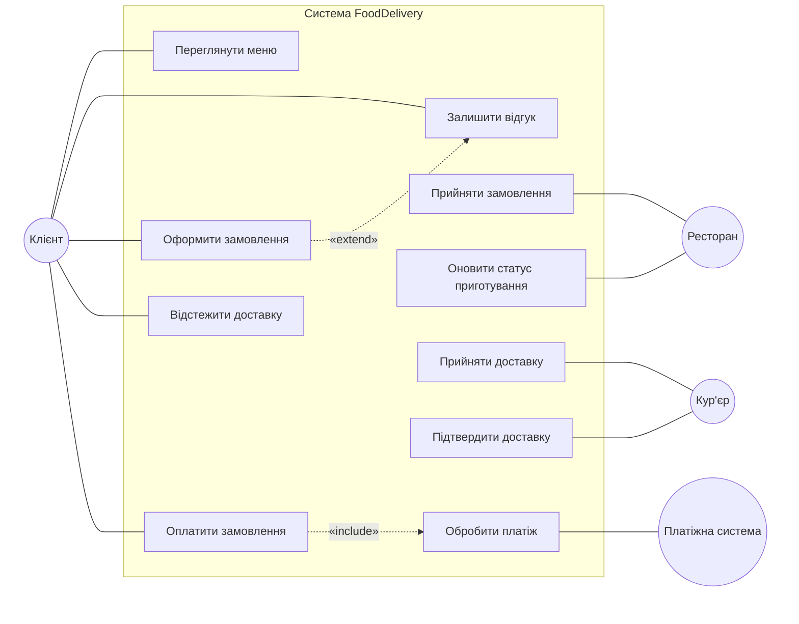
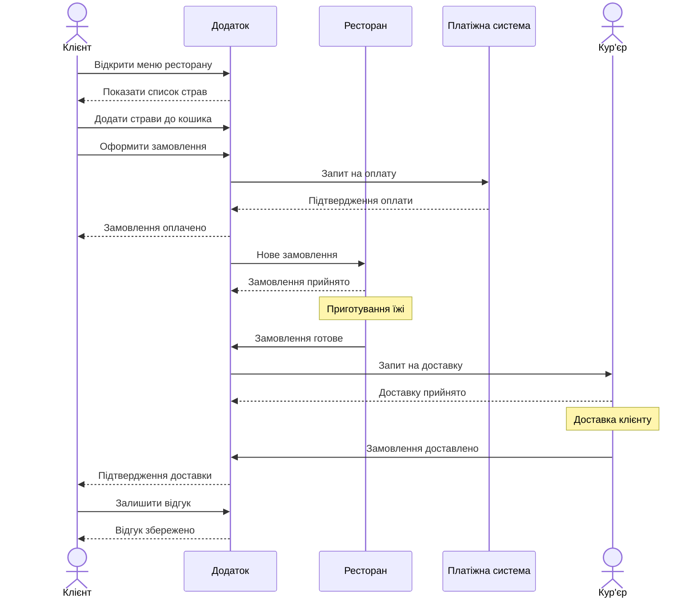
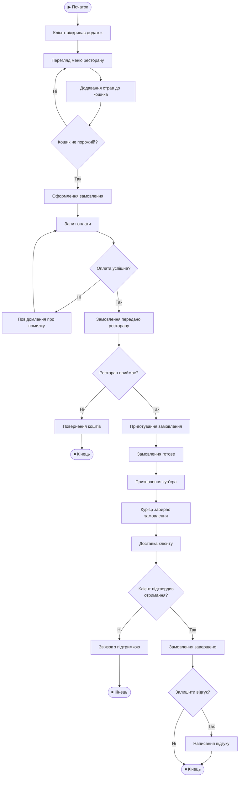

# UML-діаграми: Система онлайн-замовлення їжі (FoodDelivery)

## Опис предметної області

Система дозволяє клієнту переглядати меню ресторанів, оформлювати замовлення, здійснювати оплату та отримувати доставку. У системі взаємодіють чотири основні актори: **Клієнт**, **Ресторан**, **Кур'єр** та **Платіжна система**.

---

## 1. Діаграма варіантів використання (Use Case Diagram)

Діаграма показує, які функції системи доступні кожному актору та як вони пов'язані між собою.

**Пояснення:**
- **Клієнт** — основний користувач, який переглядає меню, замовляє, платить, відстежує доставку та залишає відгуки.
- **Ресторан** — приймає замовлення та оновлює статус приготування.
- **Кур'єр** — приймає та підтверджує доставку.
- **Платіжна система** — обробляє платежі (включена в оплату через `<<include>>`).
- Відгук є розширенням (`<<extend>>`) оформлення замовлення — необов'язкова дія.

---

## 2. Діаграма послідовності (Sequence Diagram)

Діаграма показує хронологічну послідовність взаємодій між акторами під час оформлення та доставки замовлення.

**Пояснення:**
- Суцільні стрілки (`->>`) — запити (синхронні повідомлення).
- Пунктирні стрілки (`-->>`) — відповіді.
- `Note` — коментар, що позначає процес, який відбувається на стороні актора (приготування, доставка).
- Діаграма демонструє повний lifecycle замовлення від перегляду меню до отримання відгуку.

---

## 3. Діаграма діяльності (Activity Diagram)

Діаграма відображає потік дій у процесі замовлення з точками розгалуження та паралельними процесами.

**Пояснення:**
- **Ромби** (`{ }`) — точки розгалуження (decision nodes), де потік залежить від умови.
- **Прямокутники** (`[ ]`) — дії (activity nodes).
- **Округлені** (`([ ])`) — початок/кінець процесу.
- Діаграма охоплює всі можливі шляхи: успішне замовлення, помилку оплати, відмову ресторану, проблему з доставкою.

---

## Зв'язок між діаграмами

| Аспект | Use Case | Sequence | Activity |
|---|---|---|---|
| **Що показує** | Хто і що робить | Як взаємодіють у часі | Потік дій та рішень |
| **Фокус** | Функціональні вимоги | Обмін повідомленнями | Бізнес-процес |
| **Рівень деталізації** | Високий (загальний) | Середній (один сценарій) | Детальний (всі шляхи) |

Усі три діаграми описують **один і той самий процес** — замовлення їжі через додаток — але з різних точок зору, що дає повне розуміння системи.
